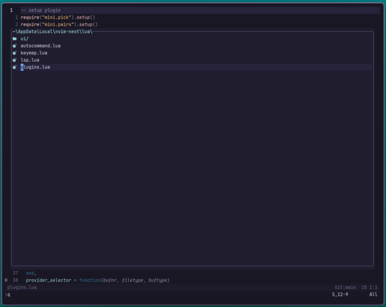
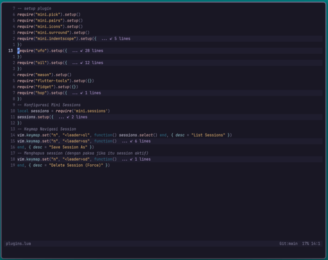
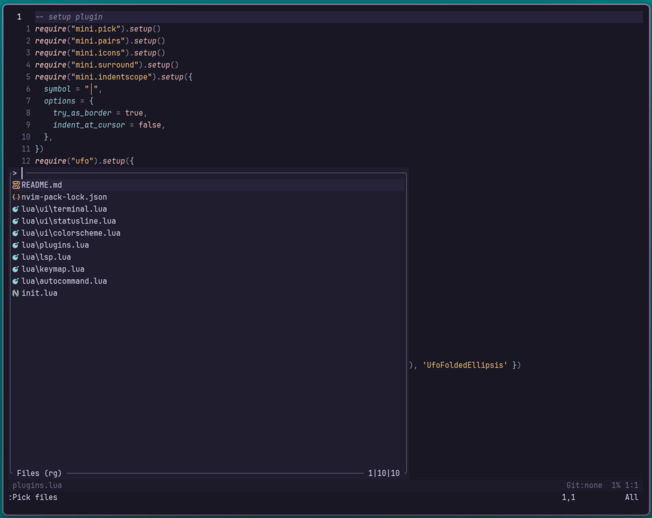
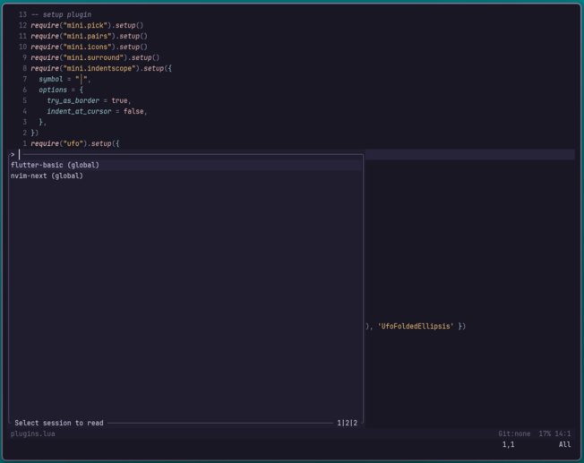

# Minimalist Neovim 0.12 (Next)

Konfigurasi Neovim yang dirancang dengan prinsip **"Clean, Fast, and Manual"**. Fokus utama pada pengembangan **Flutter** dan **Lua** menggunakan Neovim 0.12 untuk mendapatkan performa maksimal tanpa _bloatware_.

---

## Filosofi Konfigurasi

- **Minimalis Modern**: Mengandalkan ekosistem `mini.nvim` yang ringan untuk menjaga fungsionalitas tetap lengkap tanpa membebani startup time.
- **Vanilla Feel**: Minim penggunaan plugin pihak ketiga yang berat; lebih mengoptimalkan fitur bawaan Neovim terbaru.
- **Aesthetic & Flat**: Menggunakan palet warna **Rose Pine**, bisa menggunakan colorscheme nya rose pine ini atau menggunakan vanilla colorscheme yang lebih flat yang berada di folder `lua/ui/colorscheme.lua`
- **On-Demand Power**: Fitur seperti _autocompletion_ hanya muncul saat dipicu secara manual (`<C-Space>`) agar tidak mengganggu fokus saat mengetik.

---

## Fitur Utama

### Floating File Explorer

Navigasi file yang elegan menggunakan **Oil.nvim** dalam mode floating window untuk menjaga fokus pada buffer utama.


### Smart Folding & Aesthetic

Pelipatan kode cerdas berbasis LSP menggunakan **nvim-ufo**


### Fast Navigation

Pencarian file dan buffer yang cepat menggunakan **mini.pick**.


### Session Management

Dikelola menggunakan **mini.sessions** untuk menyimpan state proyek Anda secara otomatis.


### Terminal Manajemen

remaping untuk membuka dan menutup terminal tanpa plugin (powershell)


---

## Daftar Plugin Terpasang

| Kategori          | Plugin                                               | Kegunaan                                                       |
| :---------------- | :--------------------------------------------------- | :------------------------------------------------------------- |
| **Colorscheme**   | `rose-pine/neovim`                                   | Tema utama dengan nuansa gelap dan tenang.                     |
| **File Explorer** | `oil.nvim`                                           | Navigasi file berbasis buffer di floating window.              |
| **LSP & Dev**     | `nvim-lspconfig`, `mason.nvim`, `flutter-tools.nvim` | Server bahasa dan manajemen perangkat lunak pengembangan.      |
| **Navigation**    | `mini.pick`, `hop.nvim`                              | Pencarian file cepat dan navigasi kursor instan.               |
| **Editing**       | `mini.pairs`, `mini.surround`, `mini.indentscope`    | Auto-close brackets, manipulasi pengapit, dan garis indentasi. |
| **Utility**       | `mini.sessions`, `mini.icons`                        | Manajemen session proyek dan ikon flat yang ringan.            |
| **UI & Visual**   | `fidget.nvim`, `nvim-ufo`                            | Notifikasi progress LSP dan pelipatan kode modern.             |
| **Debugging**     | `nvim-dap`, `nvim-dap-ui`                            | Alat debugging profesional untuk Flutter.                      |

---

## Keymaps Pilihan

### General & System

| Keymap      | Aksi                                |
| :---------- | :---------------------------------- |
| `<leader>o` | Update & Source (Reload Config)     |
| `<leader>w` | Save File                           |
| `<leader>q` | Quit Neovim                         |
| `jk` / `jj` | Escape (Insert Mode)                |
| `<leader>y` | Copy ke System Clipboard            |
| `<leader>d` | Cut/Delete ke System Clipboard      |
| `<leader>s` | Pindah ke File Terakhir (Alternate) |

### Navigation & Buffers

| Keymap       | Aksi                         |
| :----------- | :--------------------------- |
| `<leader>e`  | Toggle Floating Oil Explorer |
| `<leader>ff` | Cari File (`mini.pick`)      |
| `<leader>bl` | Daftar Buffer Terbuka        |
| `<leader>bd` | Tutup Buffer Saat Ini        |
| `Shift + h`  | Pindah ke Buffer Sebelumnya  |
| `Shift + l`  | Pindah ke Buffer Selanjutnya |
| `<leader>h`  | Cari Help Documentation      |

### Flutter & LSP

| Keymap       | Aksi                            |
| :----------- | :------------------------------ |
| `<leader>fe` | Buka Daftar Emulator            |
| `<leader>fr` | Jalankan Project (Flutter Run)  |
| `<leader>fq` | Hentikan Project (Flutter Quit) |
| `<leader>fR` | Hot Restart                     |
| `<leader>fl` | Hot Reload Manual               |
| `<leader>lf` | Format Kode (LSP)               |
| `C-Space`    | Trigger Autocompletion (Manual) |

### Debugging (DAP)

| Keymap       | Aksi                          |
| :----------- | :---------------------------- |
| `<leader>db` | Toggle Breakpoint             |
| `<leader>dc` | Start / Continue Debugging    |
| `<leader>do` | Step Over                     |
| `<leader>di` | Step Into                     |
| `<leader>du` | Toggle UI Debug (Panel Debug) |

### Movement & Folding

| Keymap              | Aksi                            |
| :------------------ | :------------------------------ |
| `<leader><leader>w` | Hop Word (Lompat ke Kata)       |
| `<leader><leader>s` | Hop Char (Lompat ke 1 Karakter) |
| `zR`                | Buka Semua Lipatan Kode (UFO)   |
| `zM`                | Tutup Semua Lipatan Kode (UFO)  |
| `za`                | Toggle Lipatan Kode (Standard)  |

## Session Management

Konfigurasi ini menggunakan `mini.sessions` untuk menyimpan state proyek Anda secara otomatis.

- `<leader>ss` : Simpan Session (Akan diminta input nama).
- `<leader>sl` : Daftar Session yang tersimpan.
- `<leader>sd` : Hapus Session (Force delete).

---

## Otomasi & Perintah Kustom

Konfigurasi ini menyertakan beberapa otomasi untuk memastikan pengalaman koding yang lebih mulus:

### Manajemen Plugin (Custom Commands)

Karena konfigurasi ini menggunakan sistem manajemen plugin bawaan Neovim yang minimalis, tersedia perintah kustom untuk memudahkan pengelolaan:

- `:PackInstall` : Digunakan untuk mengunduh dan menginstal plugin baru yang baru saja ditambahkan ke daftar konfigurasi.
- `:PackUpdate` : Digunakan untuk mengecek dan memperbarui plugin yang sudah terpasang ke versi terbaru.

### Auto-Format on Save

Setiap kali Anda menyimpan file (Dart, Lua, dll.) menggunakan `:w` atau `<leader>w`, Neovim akan otomatis:

1. Mendeteksi LSP yang aktif pada buffer tersebut.
2. Melakukan pemformatan kode secara sinkron (blocking) sebelum file benar-benar ditulis ke disk.
3. Memastikan kode Anda selalu rapi sesuai standar _formatter_ (seperti `dart format`).

### Intelligent Auto-Session

Saat Anda membuka Neovim tanpa argumen (hanya mengetik `nvim` di terminal):

- Neovim akan mengecek apakah ada _session_ yang tersimpan di direktori data.
- Jika ada, daftar _session_ akan otomatis muncul menggunakan UI `mini.sessions` sehingga Anda bisa langsung melanjutkan proyek terakhir.
- Jika tidak ada _session_, Neovim akan memberikan notifikasi halus `No saved sessions found` di area baris perintah agar Anda tidak bingung.

---

## Instalasi

1. Pastikan Anda menggunakan **Neovim 0.12+**, (di sini saya menggunakan command untuk windows, OS lain terserah wkwkwkwk).
2. Clone repository ini ke folder konfigurasi Anda:
   ```bash
   git clone https://github.com/PAPATIRI/neovim-based.git $HOME/AppData/Local/nvim
   ```
3. Buka Neovim dan jalankan perintah untuk menginstal plugin:
   ```bash
   :PackInstall
   ```
4. Restart Neovim dan Anda siap untuk bertempur!

Dibuat dengan ❤️ untuk produktivitas maksimal.
